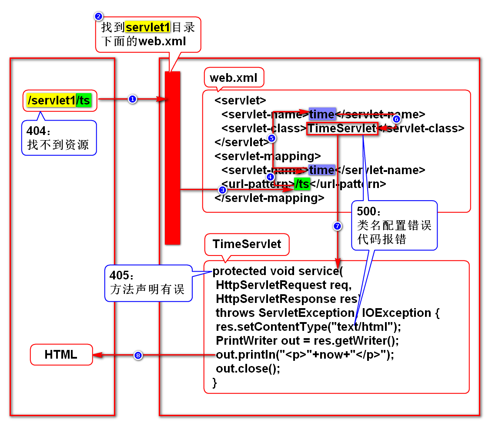
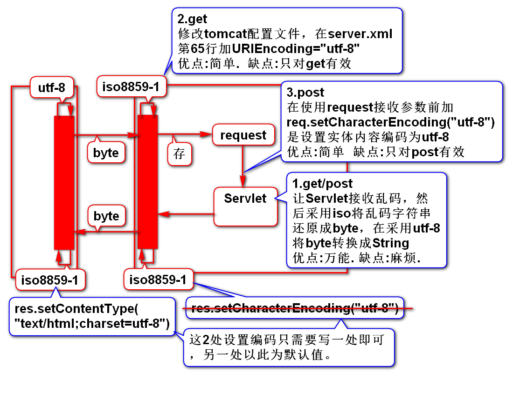
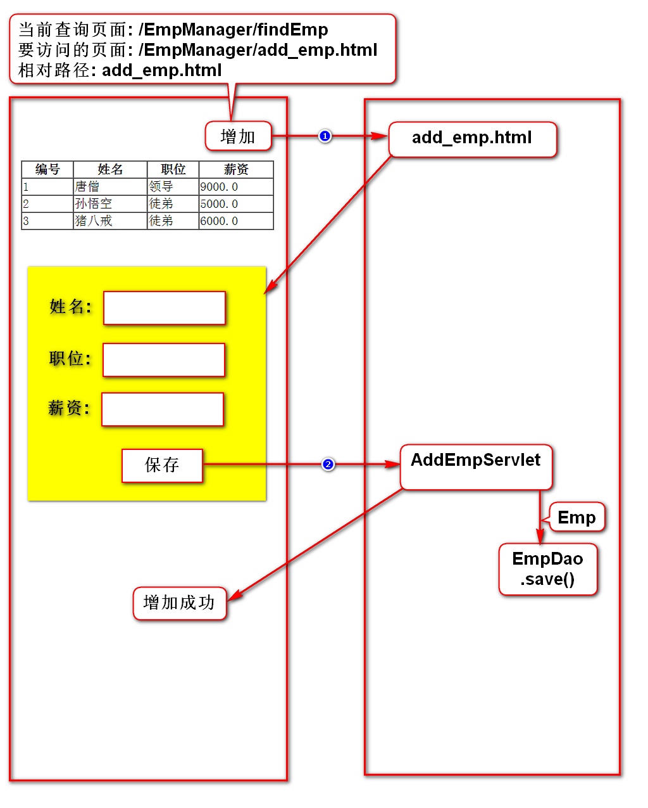
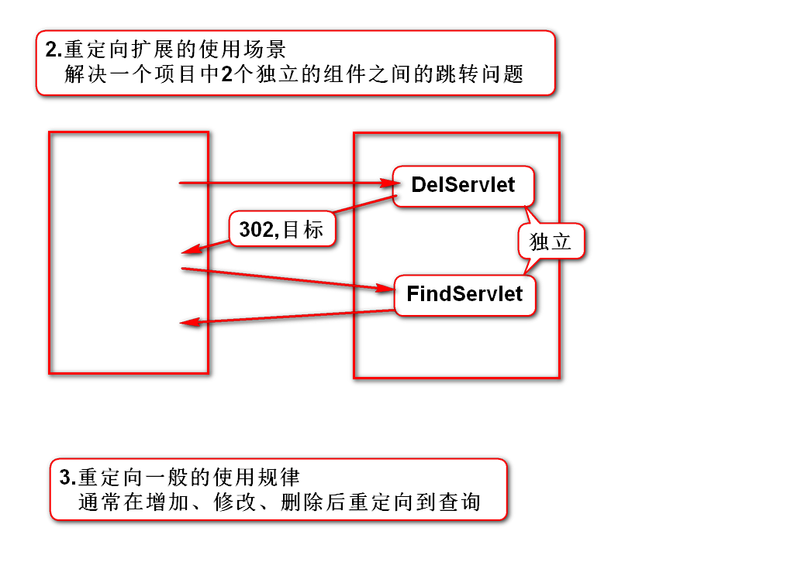
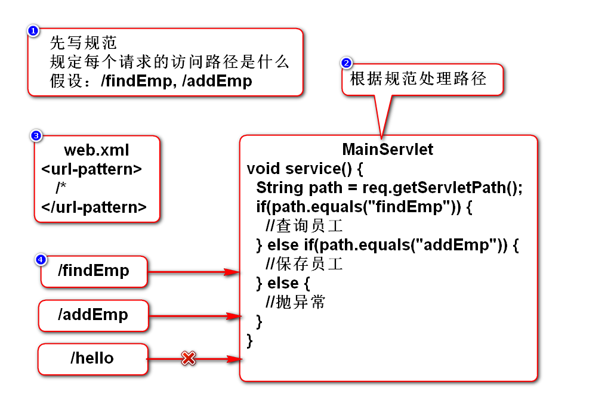
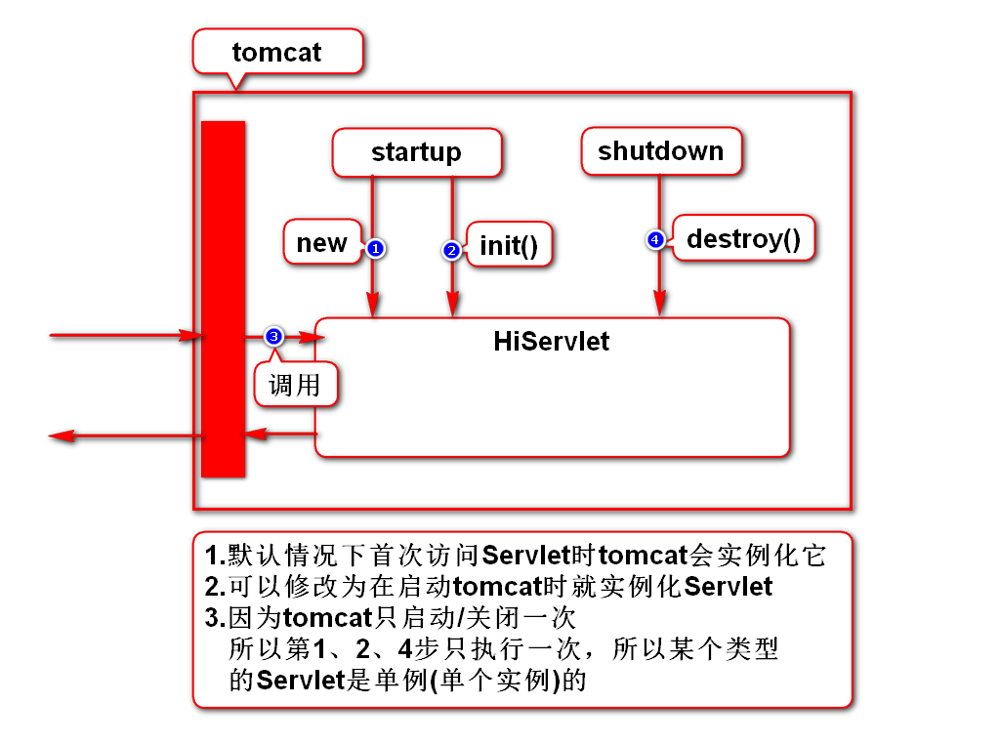
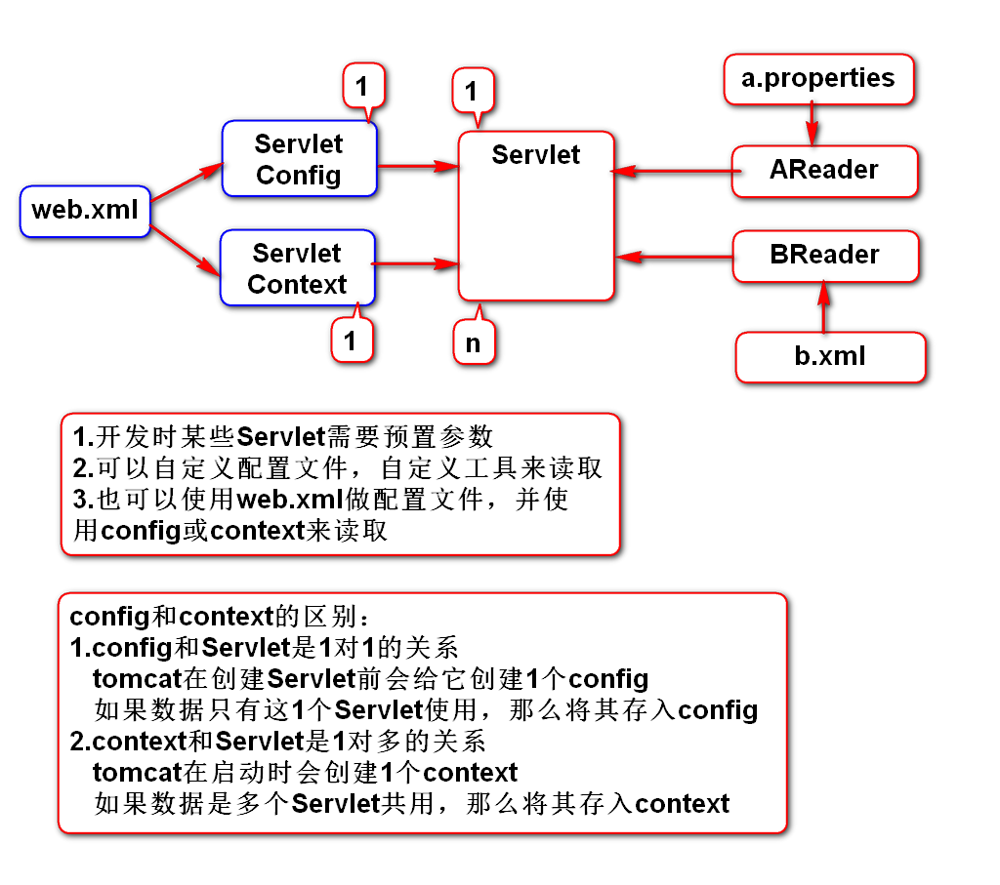
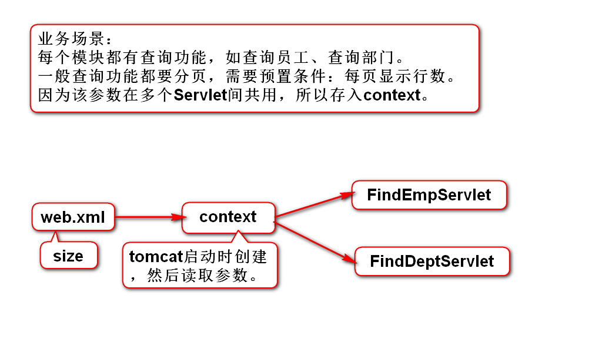

# Servlet 入门学习
# 一、WEB应用的发展
## 1.规律
- 由单机程序向网络程序发展
- 由CS程序向BS程序发展

## 2.CS和BS的区别
### CS
- Client Server
- 客户端服务程序，客户端由程序员开发，用户需要安装

### BS
- Browser Server
- 浏览器服务程序，不需要单独开发及安装

# 二、 Servlet介绍
## 1.服务器如何给浏览器返回网页？
### 1）返回静态网页
- 百度百科、新闻等
- 内容不变，任何人看都一样
- 服务器保存的一个HTML，访问时直接返回它

### 2）返回动态网页
- 微博、淘宝
- 每个人看的内容有差别
- 服务器保存一个组件，用它来拼一个动态网页
- 在Java项目中，这个组件就是Servlet
> 组件：就是满足规范的对象

## 2.Servlet具备的特征
- Servlet是存储在服务器上的
- Servlet满足sun的规范
- 它可以拼动态资源（网页、图片等）
> 可以处理HTTP协议

## 3.什么事Servlet
- 是sun推出的用来在服务器端处理HTTP协议的组件

# 三、服务器
## 1.名称
- Java服务器
- WEB服务器
- Java WEB服务器
- Servlet容器

## 2.本质
- 是一个软件：能够运行Java项目的软件
- 和浏览器相对应、平级

## 3.举例
- Tomcat
- JBoss
- WebLogic
- WebSphere

# 四、如何使用tomcat
## 1.单独使用
### 1)配置JAVA_HOME
- tomcat依赖于Java

### 2)下载及安装
- 在apache官网下载
- 直接解压缩(释放)即可，这是绿色免安装软件

### 3)启动tomcat
- Linux：打开/tomcat/bin目录，输入./startup.sh
- window：打开/tomcat/bin目录，双击startup.bat
> 给目录加权限：chmod +x *sh

### 4)访问tomcat
- 打开浏览器，输入http://localhost:8080

### 5)关闭tomcat
- Linux：打开/tomcat/bin目录，输入./shutdown.sh
- windows：打开/tomcat/bin目录，双击shutdown.bat

## 2.用Eclipse管理tomcat(开发时)
- 配置失败需要重来：
- window->preference->server->runtime
- 选择tomcat点击remove
- Eclipse左侧点击Servers项目将其删除

# 五、Servlet开发步骤
## 1.创建WEB项目
- WEB项目有标准的WEB目录：
- webapp/WEB-INF/web.xml

## 2.导入jar包
### 1)用maven搜javaee
- 在搜索结果中选择javaee-api.jar

### 2)使用tomcat内置的jar包
- 右键项目->properties->targeted runtimes->勾选tomcat->apply

## 3.开发Servlet
- 继承于HttpServlet
- 间接实现了Servlet接口(sun的规范)

## 4.配置Servlet
- 在web.xml中加以配置

## 5.部署项目
- 在Servers下点击tomcat
- 右键点击Add and Remove
- 弹出框中将项目从左侧移动到右侧
- 启动tomcat
> 部署：就是拷贝

## 6.访问Servlet
- http://localhost:8080/servlet1/ts


# 六、代码执行过程及错误


# 补充
## 一、端口占用错误
### 1.出现问题的情况
- 报错：Address already in user,JVM_BIND:8080

### 2.原因及解决方案
#### 1)tomcat启动了2次，造成端口冲突
- 打开/tomcat/bin目录，执行shutdown命令，强制关闭它

#### 2)其他软件占用了此端口(Oracle)
- 修改tomcat的端口
- 打开tomcat配置文件server.xml
- 在65行修改port="8080"，建议改为8088、8089等
- 注意：关闭tomcat时修改，然后重新启动
> 在Servers项目下可以找到server.xml配置文件


# 一、HTTP协议
## 1.什么是HTTP协议
- 就是一个规范(w3c)
- 规定了：浏览器和服务器如何通信及数据格式

## 2.如何通信
- 建立连接
- 发送请求
- 接收响应
- 关闭连接

## 3.数据格式
### 1)请求数据(浏览器向服务器发送的数据)
- 请求行：请求的基本信息
- 消息头：请求数据的描述信息
- 实体内容：请求的业务数据

### 2)响应数据(服务器向浏览器发送的数据)
- 状态行：响应的基本信息
- 消息头：响应数据的描述信息
- 实体内容：响应的业务数据

## 4.对开发的要求
### 1)不需要管的地方
- 通信的过程已经由浏览器和服务器实现了
- 请求数据的组装由浏览器实现了
- 响应数据的组装由服务器实现了

### 2)需要处理的地方
- 请求的业务数据由开发者提供
- 响应的业务数据由开发者提供
> 使用request处理请求数据，使用response处理响应数据

# 二、注册案例


# 三、Servlet运行原理


# 四、请求方式
## 1.什么是请求方式
- 浏览器向服务器发送数据的方式
- 包括很多种方式，需要掌握的是GET和POST

## 2.GET和POST方式的区别
### 1)GET
- 采用路径传参，参数在传递过程中可见(地址栏)
- 隐私性差
- 传参能力有限，只能传少量参数
- 所有的请求默认都是GET请求

### 2)POST
- 采用实体内容传参，参数在传递过程中不可见
- 隐私性好
- 实体内容专门用来传参，大小不受限制
- 在form上加method="post"

## 3.如何选择请求方式
- 一般查询时使用GET请求，因为查询条件一般比较少
- 一般保存时使用POST请求，因为保存的数据一般较多

# 五、乱码解决方案


# 六、案例
## 1.查询员工


## 2.增加员工


# 补充
## 1.什么是JavaBean
- 满足如下规范的类：
- 有package
- 有默认构造器
- 实现序列化接口
- 有get/set方法


# 一、重定向
## 1.重定向在增加员工中的应用
```java
response.sendRedirect(String url);
```


## 2.重定向的作用及原理

在重定向的过程中，影响浏览器做出动作的关键点即响应中的状态码及Location这个消息头。302状态就像一道命令一样，使得浏览器做出新的一次请求，而请求的地址会从头信息中查找。由于这个新的请求动作是由浏览器发出的，所以浏览器的地址栏上的地址会变成Location消息头中的地址。

# 二、路径
## 1.路径是什么


## 2.如何获取路径
- 项目名：req.getContextPath()
- Servlet路径：req.getServletPath()
- 绝对路径：req.getRequestURI()
- 完整路径：req.getRequestURL()

## 3.URI(Uniform Resource Identifier)和URL(Uniform Resource Locator)的区别
### 1)狭义的理解(Java项目)
- URI(统一资源标识符)是绝对路径，而URL是完整路径
- URL(全球资源定位器)包含了URI

### 2)广义的理解(Web项目) *
- URI是资源的名字
- URL是资源的真名
- URI包含了URL
> 真名只有一个，名字可以有多个

## 4.Servlet访问路径的配置方案
### 1)精确匹配(/hello)
- 只有这一个路径可以访问此Servlet
- 此Servlet只能处理一个请求

### 2)通配符(/*)
- 所有的路径都可以访问此Servlet
- 此Servlet能处理所有请求

### 3)后缀(*.abc)
- 所有以abc为后缀的路径都可以访问此Servlet
- 此Serlvet能处理多个请求

### 4)用1个Servlet处理多个请求的方案


### 5)通配符和后缀的典型应用场景


# 三、Servlet生命周期
Servlet容器如何创建Servlet对象、如何为Servlet对象分配、准备资源、如何调用对应的方法来处理请求以及如何销毁Servlet对象的整个过程即Servlet的生命周期。
## 1.生命周期相关方法的调用顺序

###阶段一、实例化
```
<servlet>
    <servlet-name>someServlet</servlet-name>
    <servlet-class>test/SomeServlet</servlet-class>
        <load-on-startup>1</load-on-startup>
</servlet>
<servlet-mapping> 
    <servlet-name>someServlet</servlet-name>
    <url-pattern>/*</url-pattern>
</servlet-mapping>
```

配置文件中的**load-on-startup**节点用于设置该Servlet的创建时机。
当其中的值**大于等于0**时，表示容器在启动时就会创建实例
**小于0时或没有指定**时，代表容器在该Servlet被请求时再执行**创建
正数的值越小，优先级越高，应用启动时就越先被创建。**

###阶段二、初始化

在初始化阶段，init（）方法会被调用。这个方法在javax.servlet.Servlet接口中定义。其中，方法以一个ServletConfig类型的对象作为参数。ServletConfig对象由Servlet引擎负责创建，从中可以读取到事先在web.xml文件中通过<init-param>节点配置的多个name-value名值对。ServletConfig对象还可以让Servlet接受一个ServletContext对象。
一般情况下，init方法不需要编写，因GenericServlet已经提供了init方法的实现，并且提供了getServletConfig方法来获得ServletConfig对象。
**注：init方法只被执行一次。**

###阶段三、就绪

Servlet被初始化以后就处于能够响应请求的就绪状态。每个对Servlet的请求由一个ServletRequest对象代表，Servlet给客户端的响应由一个ServletResponse对象代表。当客户端有一个请求时，容器就会将请求与响应对象转给Servlet，以参数的形式传给service方法。service方法由javax.servlet.Servlet定义，由具体的Servlet实现。

###阶段四、销毁

Servlet容器在销毁Servlet对象时会调用destroy方法来释放资源。通常情况下Servlet容器停止或者重新启动都会引起销毁Servlet对象的动作，但除此之外，Servlet容器也有自身管理Servlet对象的准则，整个生命周期并不需要人为进行干预。

## 2.config和context的联系和区别


## 3.ServletConfig


## 4.ServletContext


